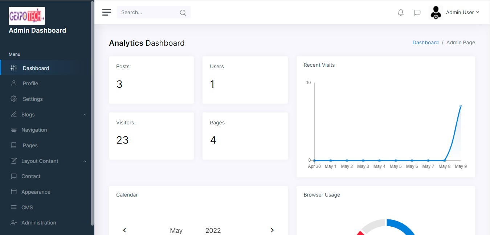

# GexpoCMS

GexpoCMS is an open-source CMS developed with ASP.NET Core 3.1 to provide common business website functionalities.

  <kbd>
    
  </kbd>

## Description

GexpoCMS is an open source CMS built using ASP.Net Core 3.1 to provide common business website funtionalities and is based on [bootstrapmade](https://bootstrapmade.com/bootstrap-5-templates/) themes.

### Features

- Registration & Authentication
- Backend Content Management
- Access Control
- Multiple Themes
- Blogging
- Multi Language
- Sliders
- Custom Navigation
- Custom Theme Color
- Counters
- Testimonial
- Portfolio
- Contact Form
- Donation Pages
- Call To Action
- FAQs
- Partners Section
- And more...

### Built with

- .NET Core 3.1

### Demo

- [akassama.com/demos/gexpo-cms/](#!)

## Getting started

### Install

* Clone or download the GexpoCMS Core project to your projects folder
* Using the file explorer, go to the `GexpoTechCMS\db` folder, open the `dp.sql` with a text editor. 
* Copy the entire queries in the `dp.sql` file 
* Create a database in your MS SQL Server Management Studio. 
  * E.g. GexpoTechDb
* In your SQL Server, right click on GexpoTechDb and select “New Query”. Then paste and execute the copied query.
   * Click the Execute button in the MS SQL Server Management Studio to run the query or press (F5)
   * Make sure to delete or remove the `db` folder upon executing the query
* Open the downloaded project on visual studio. You can do so by going to the GexpoTechCMS folder and double clicking on the GexpoTechCMS.sln file. You may also right click on it and select open with “Visual Studio”
* Once the project is open in visual studio, make sure you update the ConnectionStrings in `appsettings.json` file. Set the `Server=` and `Database=` variables to that of your MS SQL Server and Database created respectively.
* You may also set other configurations in the `appsettings.json` such as `sendGridKey`, `organizationName`, `seoAuthor`, `seoDescription`, `seoKeywords`
* From Visual Studio, you can run the application now and use the following default login details:
  * Email: admin@example.com
  * Password: Admin123

### Usage

* Run the application from Visual Studio
* To login, click on the user icon on the navigation menu
* Enter the default logins mentioned above
* You can now manage the site content and users from the back-end

  <kbd>
    
  </kbd>

### See also

- [password-generator](https://github.com/akassama/password-generator)
- [sql-query-generator](https://github.com/akassama/sql-query-generator)
- [case-converter](https://github.com/akassama/case-converter)
- [guid-generator](https://github.com/akassama/guid-generator)
- [keywords-extractor](https://github.com/akassama/keywords-extractor)
- [jquery-character-counter](https://github.com/akassama/jquery-character-counter)
- [bootstrap-search-autocomplete](https://github.com/akassama/bootstrap-search-autocomplete)
- [jquery-datables-crud](https://github.com/akassama/jquery-datables-crud)
- [bootstrap-search-autocomplete](https://github.com/akassama/bootstrap-search-autocomplete)
- [akassama-projects](https://github.com/akassama/projects)

### License

This project is licensed under the [MIT License](https://opensource.org/licenses/MIT).